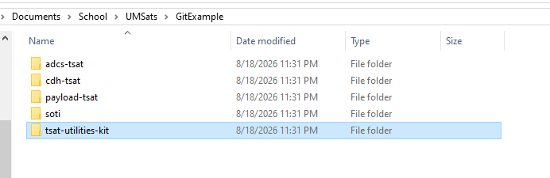

## Setup
To set up the project you must also have the tsat-utilities-kit repository cloned and positioned in the correct directory locations so that the project linker can find the library.  
Use the git command `git clone <repository_url>` to clone the Payload and TUK repos in the desired workspace for UMSATS projects or use the github desktop app UI to achieve the same result.  
The following image gives you the correct project layout needed for the code to function and compile properly.
  
With this directory setup, the main branch of the project should compile and you can begin coding.  

## License

This project is licensed under the MIT License - see the [LICENSE](LICENSE) file for details.

By contributing to this repository, you agree that your contributions will be licensed under the MIT License.
